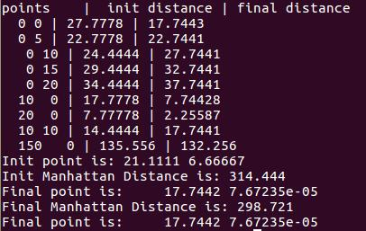

# MinManhattan

Minimize Manhattan distance of points.

## request

Matrix library:
[`Eigen`](http://eigen.tuxfamily.org/index.php?title=Main_Page "eigen")

Nonlinear solver:
[`Ceres Solver`](http://ceres-solver.org/ "Ceres Solver")

## build 

```
mkdir build
cd build 
cmake ..
make 
```

## run

In build folder:

```
./manhattan_test
```

## result

<p align="center">
  
</p>
